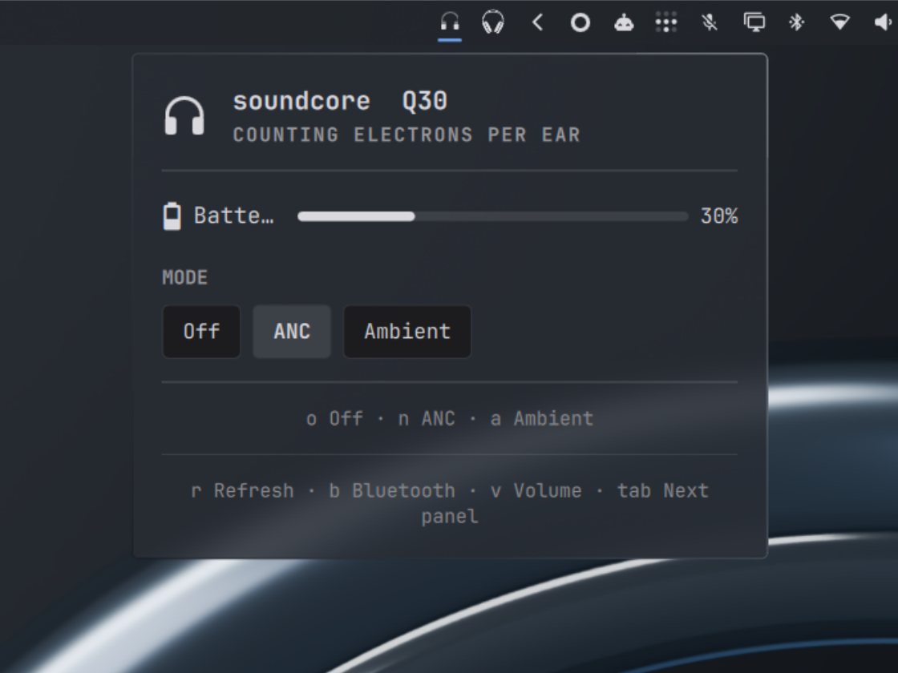

<h1 align="center">Soundcore Q30</h1>

<p align="center">Battery and listening mode for the <b>soundcore Life Q30</b> (A3028), in the Omarchy bar.</p>

<p align="center"></p>

## What it does

- **Battery** — one figure, from Google Fast Pair, drawn into the bar icon as it
  fills. The headphones' own state adds whether they are charging.
- **Listening mode** — Off, ANC and Ambient, from the panel or `o` `n` `a`.
- **ANC grade** — Transport, Outdoor, Indoor or Custom, from the panel or `1`-`4`.
  The Q30 grades its noise cancelling by the place you are in rather than by
  strength, and keeps the grade whichever mode is on.
- **Equalizer** — the 22 Soundcore presets and your own curve, stepped with the
  arrows or `-` and `=`. Choosing a preset makes the headphones drop the custom
  curve they hold (the phone app keeps its copy on the phone), so the plugin
  saves the curve to `~/.local/state/kevin-q30/custom-eq.json` the first time it
  sees it, and **Custom** sends it back.

The Q30 has no ambient level and no wind noise reduction, so the panel shows no
dial and no switch. Editing the custom curve band by band is not offered: set it
in the phone app once, and the plugin keeps it from then on.

From a terminal: `omarchy-shell q30 mode`, `setMode ambient`, `ancLevel`,
`setAncLevel indoor`, `eq`, `setEq "Bass Booster"`, `status`.

## Install

```bash
omarchy plugin add https://github.com/kevinbsr/omarchy-soundcore-q30
omarchy bar put kevin.q30 --section right
```

## Where this came from

This is a trimmed fork of [Omaphones](https://github.com/ncr/omarchy-headphones)
by [Jacek Becela](https://github.com/ncr), MIT licensed, which supports JBL,
Sony, Samsung, Nothing / CMF, Soundcore, Xiaomi, OPPO and Bose. **If you own
anything other than a Q30, use that plugin, not this one.** Everything here is
his work except the Q30 model row, which was sent upstream as
[PR #18](https://github.com/ncr/omarchy-headphones/pull/18) and is the better
home for it: one plugin that knows every brand beats eight that each know one.

What this fork carries is what a Q30 needs: the Soundcore RFCOMM bridge with
one model row, the Fast Pair battery reader, the panel and the shell service.
The other seven bridges, their probes, pins, captures and gallery images are
gone — about two thirds of the tree.

## The Q30's two differences

Its `01 01` state is **70 bytes** with the sound-mode block at **35**, and that
block is **four bytes wide**, not six. Byte 39 starts the firmware string, so a
six-byte read takes two ASCII characters and posts them back as mode parameters
on the next write. [PROTOCOL.md](PROTOCOL.md) has the captures, including the
write that put `1f ff` where the device kept `01 00`.

## Development

```bash
python3 -m unittest discover -s . -p '*_test.py'   # bridge and reader tests
deno test --allow-read tests/model.test.js         # routing
tools/check                                        # everything, as upstream runs it
tools/soundcore_probe.py 88:0E:85:5F:64:B4 20      # talk to the headphones
```

`tests/pins/soundcore/life-q30.json` is a frozen session of real bytes from the
device: what it answered, what the bridge sent back, and what the panel was
told. Upstream's convention, kept here.

## License

MIT, as upstream. See [LICENSE](LICENSE).
